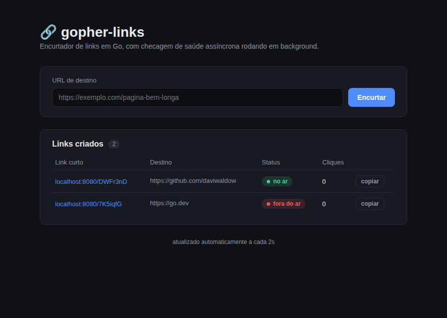

# gopher-links

Encurtador de links feito em Go puro (sem frameworks web), com um painel
visual simples e uma checagem de saúde assíncrona: quando um link é criado,
um pool de workers verifica em background se a URL de destino está no ar,
sem travar a resposta da API.

Fiz esse projeto pra estudar/mostrar concorrência em Go de um jeito
aplicado — não só "print de goroutine", mas um worker pool de verdade
resolvendo um problema real (checar disponibilidade de várias URLs sem
bloquear as requisições).



## No ar

- **Painel:** https://gopherlinks.web.app — frontend estático no Firebase Hosting
- **API:** https://gopher-links.onrender.com — backend Go no Render, com Postgres

O deploy é contínuo: cada push na `main` publica o frontend no Firebase e
reconstrói o backend no Render automaticamente (ver `.github/workflows/`).

## Como funciona

- `POST /api/shorten` cria o link e responde na hora, com status
  `pending`. A checagem da URL roda depois, em background.
- Um **worker pool** (`internal/worker`) consome os jobs de checagem por um
  channel. Cada checagem tem seu próprio timeout via `context`, então uma
  URL lenta ou travada não trava os outros workers.
- O resultado (`healthy` / `unhealthy`) é gravado de volta no store, e o
  painel visual (`GET /`) fica consultando `GET /api/links` a cada 2
  segundos pra mostrar a atualização sem precisar dar F5.
- O armazenamento (`internal/store`) fica atrás de uma interface (`Store`),
  com duas implementações: **em memória** (padrão, ótima pra dev e testes) e
  **Postgres** (`PostgresStore`, usada quando `DATABASE_URL` está definida —
  aí os links persistem entre reinícios). Os handlers e o worker pool
  dependem só da interface, então não mudam ao trocar de uma pra outra.
- Extras: **alias personalizado** (campo `alias` no POST), **expiração** de
  links por TTL (`LINK_TTL_DAYS`, com limpeza periódica em background) e
  **rate limiting** por IP no `/api/shorten` (`RATE_LIMIT_PER_MIN`).

## Rotas

| Método | Rota                  | O que faz                                    |
|--------|-----------------------|-----------------------------------------------|
| GET    | `/`                    | painel visual                                 |
| POST   | `/api/shorten`         | body `{"url":"...","alias":"opcional"}` → cria um link |
| GET    | `/{code}`              | redireciona (302) pro destino e conta o clique |
| GET    | `/api/links/{code}`    | metadados de um link específico               |
| GET    | `/api/links`           | lista todos os links                          |
| GET    | `/healthz`             | healthcheck do próprio servidor               |

### Exemplo via curl

```bash
curl -X POST localhost:8080/api/shorten -d '{"url":"https://go.dev"}'
# {"code":"aB3xQ9z","destination":"https://go.dev","status":"pending",...}

curl localhost:8080/api/links/aB3xQ9z
# status vira "healthy" assim que a checagem em background termina
```

## Rodando localmente

```bash
make run          # sobe em http://localhost:8080
make build        # gera o binário em bin/gopher-links
make test         # roda os testes
make test-race    # roda os testes com o detector de race conditions
```

Depois é só abrir `http://localhost:8080` no navegador.

## Estrutura

```
cmd/server/           # main() — sobe o servidor e desliga tudo direito no Ctrl+C
internal/store/        # interface Store + implementações: memória e Postgres (pgx)
internal/worker/       # worker pool das checagens de saúde assíncronas
internal/handlers/      # handlers HTTP + middlewares (CORS, headers de segurança)
internal/webui/         # painel visual (HTML/CSS/JS embutido no binário)
firebase/              # cópia estática do painel + config do Firebase Hosting
Dockerfile             # build do backend pra rodar em Cloud Run / Render / etc.
render.yaml            # blueprint pra deploy no Render em um clique
.github/workflows/     # CI/CD: deploy do frontend, keep-warm, testes Go, secret-scan
DEPLOY.md              # passo a passo geral: frontend no Firebase + backend grátis
CLOUDRUN.md            # deploy do backend no Google Cloud Run (contínuo via GitHub)
```

## Rodando em produção (Firebase + host grátis)

O painel pode ser servido pelo próprio Go (do jeito acima) **ou** hospedado
separado no Firebase Hosting, com o backend Go num host gratuito (Render,
Cloud Run...). Nesse modo o frontend e o backend ficam em domínios diferentes,
por isso o backend tem CORS e lê a porta de `PORT`. O passo a passo completo
está em [DEPLOY.md](DEPLOY.md), e o deploy do backend no Google Cloud Run
(contínuo via GitHub) em [CLOUDRUN.md](CLOUDRUN.md).

## Variáveis de ambiente

| Variável         | Padrão   | Pra que serve                                       |
|------------------|----------|------------------------------------------------------|
| `PORT`               | `8080`    | porta do servidor (os hosts grátis injetam isso)                  |
| `ALLOWED_ORIGIN`     | `*`       | origem(ns) liberada(s) no CORS; aceita lista separada por vírgula |
| `DATABASE_URL`       | *(vazio)* | connection string do Postgres; sem ela, usa store em memória      |
| `LINK_TTL_DAYS`      | `0`       | dias até um link expirar (0 = nunca)                              |
| `RATE_LIMIT_PER_MIN` | `30`      | máximo de links que um mesmo IP cria por minuto (0 = sem limite)  |

## Próximos passos (se eu continuar isso depois)

- métricas (Prometheus) + dashboard de uso
- QR code pra cada link curto
- painel de administração pra listar/remover links
